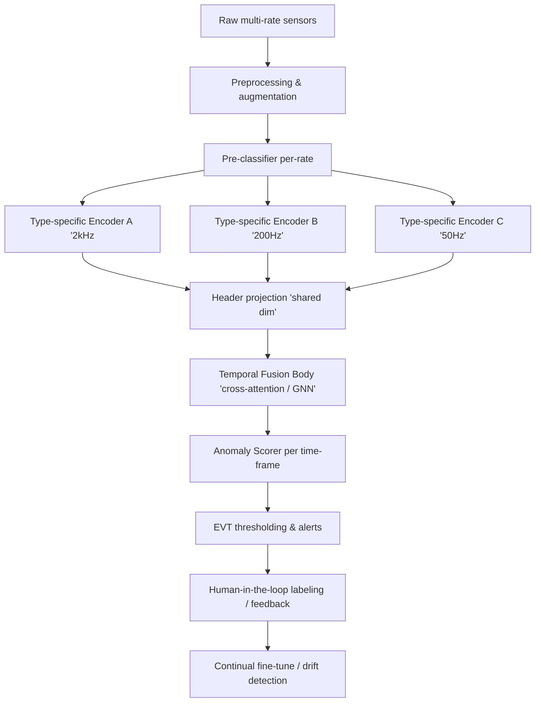
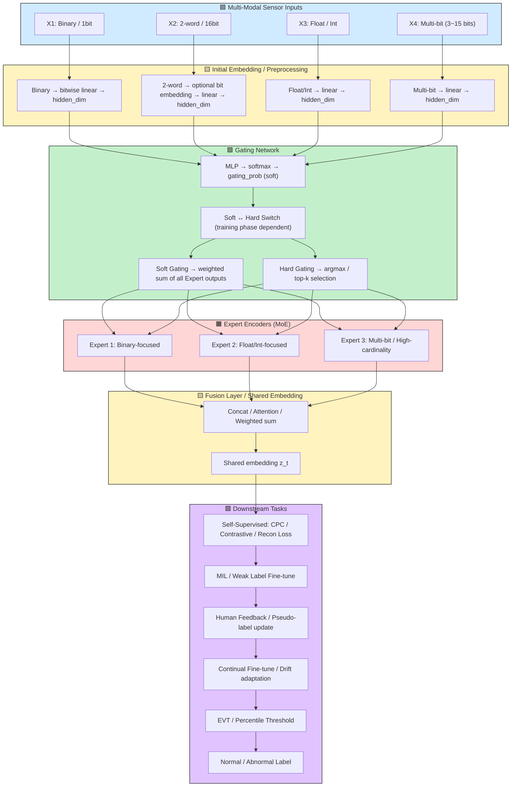
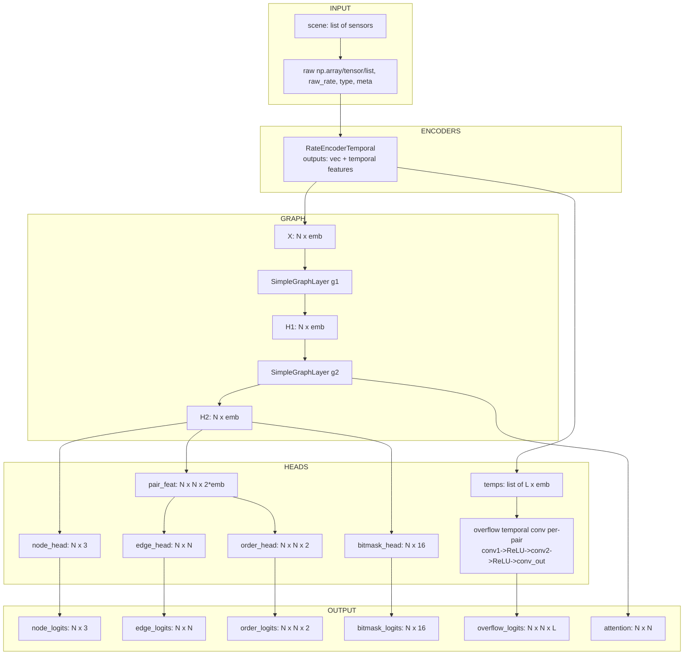
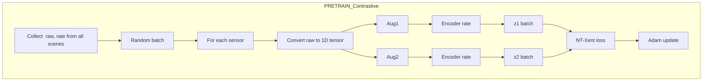
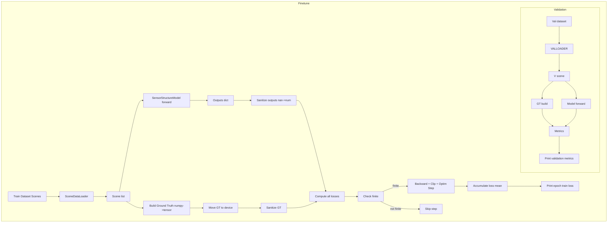
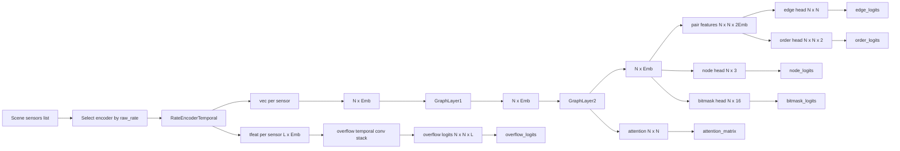
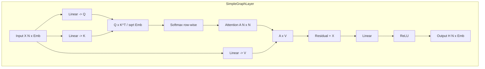
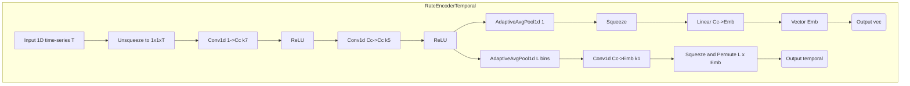

# AIbemyEYE

Stage 0 — 전제/데이터 파이프라인 준비 (필수)

목표: 모델이 요구하는 입력 형태·증강·메타데이터 규격을 정의한다.

원시 포맷 규격

한 센서 항목: {id, raw_rate, raw_array (numpy), meta: {type? bit_start? pair?}, time_start(optional)}

파일/스톱시스템

큰 데이터는 per-scene 파일(예: 10~60s 단위), 압축은 zarr/hdf5 권장.

Preproc

정규화: 각 센서별 robust z-score (x - median)/MAD 또는 min-max(0..1) — rate별로 차등 적용.

Missing handling: 선형보간/forward fill/flag.

Augment

Contrastive용: jitter, scale, mask, cutout, bitflip(for bitfields), reorder windows (for permutation invariance experiments).

Metadata

raw32 보관 등 2word 관련 정보는 meta에 보관.

Stage 1 — Pre-classifier (data type 식별)

목적: 각 센서(또는 센서 행렬)를 보고 type ∈ {1word, 2word, complex_bits} 를 예측. 또한 2word라면 pair candidate(LSB/MSB) 가능성을 제공.

접근 (실무 권장)

Per-rate pre-classifier: 같은 raw_rate 그룹끼리 별도 pre-classifier(빠른 inference).

모델: 1D-CNN → Attention pooling → MLP classifier

이유: CNN은 variable length 허용, 파라미터 적음, 빠름.

입력: single-sensor time series (variable T)

출력:

node_type_logits (3-way softmax)

pair_score_vector (N-length if entire scene provided) — optional: if you feed whole scene, else produce embeddings for candidate pairing stage

학습

데이터: 시뮬레이터로 대규모 synthetic dataset 생성 (다양한 bit/word arrangements, msb/lsb 위치, random scattering).

loss: CrossEntropy(node_type) + (optional) contrastive loss for embedding separability

hparams (권장):

emb_dim = 128, lr = 1e-3, batch_size = 256 (sensor-level), epochs = 50

augment each sample twice for contrastive pretrain if desired, temp=0.1

Output 인터페이스
preclassifier.predict(sensor_tensor) -> {
  'type_probs': [p1,p2,p3],
  'emb': vector128  # optional
}

Stage 2 — 타입별 인코더 + Header/Body 통합

목적: 각 rate/type에 최적화된 인코더로 특징을 뽑아 공통 dimension으로 투영(헤더), 이후 시간·센서 간 상호작용(바디)으로 이상점 판단.

2.1 Type-specific encoders (Header)

구조:

For high-rate (2kHz): TCN / 1D-CNN stack (dilated) → multi-scale features → temporal-compressed representation (L_bins × D) + pooled vector v (D).

For mid/low-rate: ResNet1D / small Transformer → same outputs.

For complex bits: bit-aware encoder:

Parse 16-bit word vector per time step into bit-channels (16 dims) → small conv over time + embedding → also detect local patterns such as toggles, counters.

Output:

v_i (sensor-level vector, dim D) — for GNN/ML fusion input

T_feat_i (temporal compressed features shape L×D) — for overflow/time-event prediction & framewise scoring

2.2 Header Network (Projection)

All encoders project to a shared D (e.g. 128) via small MLP: proj(v) -> z.

This allows heterogeneous encoders to feed a common fusion module.

2.3 Body Network (Fusion)

Two main choices:

A) Cross-Attention Transformer (recommended)

Input: sequence of node-temporal-embeddings — we can represent each sensor as sequence of L tokens (temporal compressed).

Use a multi-modal cross-attention:

Per-sensor temporal tokens attend within-sensor (local) then cross-sensor.

Design: per-sensor encoder outputs L×D; create tokens sensor_id + time_bin and apply Transformer layers with sparse attention (local + cross-sensor top-k).

Output: per-time-bin anomaly scores per sensor (or aggregated per global time bin).

B) GNN over sensor-nodes + temporal tokens

Build graph nodes = sensors; edges built from similarity/physical adjacency; node features = pooled + aggregated temporal summaries.

Use message passing → update node state and optionally decode temporal predictions using the temporal compressed features and pairwise attention.

2.4 Output(s)

framewise anomaly score: score_{sensor, bin} (continuous)

binary decision: after EVT thresholding or percentile thresholding → normal/abnormal

pairing outputs: pair likelihood matrix (for 2word detection)

bitmask predictions: for bits nodes (optional)

Losses (unsupervised / weakly-supervised)

Because labels mostly absent, use self-supervised + weak labels + EVT:

Self-supervised representation losses (pretrain)

Contrastive (NT-Xent) on v or on temporal tokens (positive = augmented views of same sensor window, negatives = other sensors/windows).

CPC (Contrastive Predictive Coding): predict future compressed token given past.

Masked reconstruction for bits (predict masked bits from context).

Reconstruction loss (optional AE head)

Reconstruct temporal compressed features, use MSE. Helps modeling typical patterns.

Temporal scoring loss (semi-supervised / pseudo)

If you have small labeled anomalies (or human in loop), supervise with BCE/CE on frame level.

Pair detection and overflow losses (for 2word)

Pair contrastive: bring MSB/LSB embeddings close (if pair known from meta or synthetic).

Overflow event detection: per-pair time-bin BCE on detected rollovers (if raw32 available in synthetic training).

Regularization

Cosine-norm constraints, KL-diversity for experts in MoE, dropout.

Loss composition example (training head & body)

L = λ_c * L_contrastive + λ_rec * L_recon
    + λ_pair * L_pair + λ_overflow * L_overflow_bins


Initial recommended λ values:

λ_c = 1.0, λ_rec = 0.5, λ_pair = 0.5, λ_overflow = 1.0 (tune per dataset)

Stage 2 Practical Training Recipe

Pretrain encoders (self-supervised):

Per-rate pretrain using contrastive/CPC for 50–200 epochs.

Augmentations: jitter/mask/bitflip/time-warp

Freeze header → train fusion (body) with contrastive + reconstruction:

Optionally initialize fusion with small LR on encoder params.

If small labeled set available:

Finetune with framewise BCE on anomaly labels (weak-supervision).

Estimate anomaly score distribution on validation normal data:

Collect validation normal set (or most of data assumed normal) → compute scores → fit EVT (Generalized Pareto Distribution) to upper tail of scores or use percentile (e.g. 99.5%) as initial threshold.

Stage 3 — Thresholding, Human-in-the-loop, Continual Finetune
EVT thresholding (recommended)

For anomaly scores s_t, estimate tail behavior:

Choose high threshold u (e.g., 95th percentile of s_t on validation normal set)

Collect exceedances y = s_t - u and fit GPD to y

Choose target false alarm rate α (e.g., 1e-3/day) → invert GPD to get decision threshold s*

Practical simplification: if no EVT impl, use percentile thresholds (99.7%).

Human-in-the-loop

Show top-k highest scoring windows to an operator for labeling (active learning).

Two feedback styles:

Binary correction: operator marks window normal/abnormal → add as labeled examples for finetune.

Weak region marking: operator marks long intervals abnormal → produce weak labels for MIL (Multiple Instance Learning).

After accumulating N_feedback (e.g., 200 samples), perform finetune:

Small LR, weighted BCE with positive class upsampling, early stopping.

Continual learning / drift adaptation

Keep an online buffer of recent features/scores.

Drift detection:

Monitor embedding distribution shift via KL divergence or MMD between current window and baseline.

If drift detected, trigger unsupervised adaptation: fine-tune encoders on recent data with self-supervised objectives (contrastive + replay).

Use regularized finetune: LR low (1e-5), batchnorm momentum reset, freeze lower layers.

Stage 4 — Evaluation & Metrics

Because supervised labels are scarce, use a mixture:

A. If small labeled eval set exists:

Frame-level: Precision/Recall/F1, AUROC (score vs label), AUPR

Event-level: segment-level IoU (predicted abnormal segments vs GT segments)

Pair detection (for 2word): precision/recall/F1 on pair edges

Bitmask IoU for bits nodes

B. Unsupervised diagnostics (no labels)

Reconstruction error distribution on held-out normal set

Embedding cluster stability (k-means inertia over time)

Alarm rate vs. operator time (false alarm rate) — major production metric

C. Drift & robustness

Monitor score quantiles (median, 95th, 99.9th) over sliding windows → alert if shifting significantly.




파일 구조
``` bash
project/
├─ data/
│  ├─ generator.py            # realistic generator for sim data
│  ├─ dataset.py              # SceneDataset, sensor loaders
├─ models/
│  ├─ preclassifier.py        # per-rate pre-classifier model
│  ├─ encoders.py             # rate-specific encoders
│  ├─ fusion.py               # cross-attention/GNN fusion
│  ├─ heads.py                # anomaly head, overflow head, pair head
├─ train/
│  ├─ pretrain.py             # contrastive pretrain scripts
│  ├─ finetune.py             # fusion training with loss composition
│  ├─ evaluate.py             # metrics, EVT thresholding
├─ tools/
│  ├─ augment.py
│  ├─ evt.py                  # EVT fit & threshold utilities (GPD)
│  ├─ viz.py
└─ experiments/
   └─ config.yaml

```


Soft ↔ Hard gating 전환 전략 포함 MoE multi-modal pipeline을 Mermaid flow로 시각화

**heterogeneous 센서 입력, gating network, expert encoders, soft/hard gating 선택, fusion, shared embedding, downstream task, EVT threshold까지 포함됩니다.**




사용 설명 (간단)

generate_multimodal_data_advanced(...) 호출로 센서 리스트와 (N x target_T) 정렬된 행렬을 얻습니다.

MoEMultiSensorDataset는 PyTorch 학습 루틴에 바로 사용될 수 있는 형태로 각 센서의 원시(raw)와 정렬(aligned) 데이터를 제공합니다.

anomaly insert는 anomaly_cfg 파라미터로 제어 가능합니다.

use_multirate=True이면 센서별로 랜덤하게 50/200/2000Hz를 사용하여 원시 데이터를 만들고, 마지막에 모두 resample로 target_T 길이로 정렬합니다.


**"main_pre_classifier.py"** 구조




**Contrastive Learning(pretrain)**




**Full fine-tue Learning**




** Module Structure - 전체 모델 구조 **


** Module Structure(Simple GraphLayer) **


** Module Structure(Rate Encoder Temporal) **

