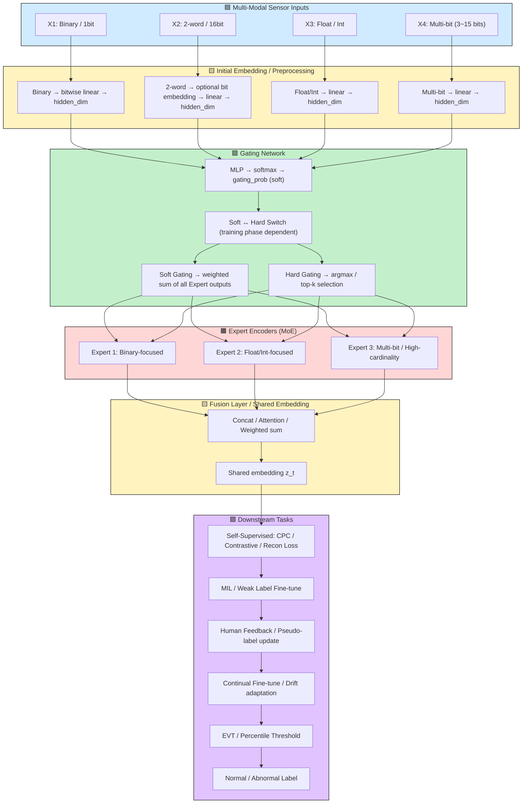

# AIbemyEYE

Soft ↔ Hard gating 전환 전략 포함 MoE multi-modal pipeline을 Mermaid flow로 시각화

**heterogeneous 센서 입력, gating network, expert encoders, soft/hard gating 선택, fusion, shared embedding, downstream task, EVT threshold까지 포함됩니다.**

사용 설명 (간단)

generate_multimodal_data_advanced(...) 호출로 센서 리스트와 (N x target_T) 정렬된 행렬을 얻습니다.

MoEMultiSensorDataset는 PyTorch 학습 루틴에 바로 사용될 수 있는 형태로 각 센서의 원시(raw)와 정렬(aligned) 데이터를 제공합니다.

anomaly insert는 anomaly_cfg 파라미터로 제어 가능합니다.

use_multirate=True이면 센서별로 랜덤하게 50/200/2000Hz를 사용하여 원시 데이터를 만들고, 마지막에 모두 resample로 target_T 길이로 정렬합니다.
